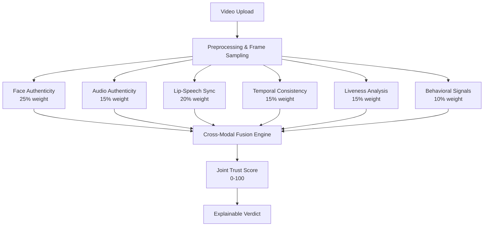

# DeepShield

**Multi-Layer Deepfake & Identity Verification System**

> "Don't trust one check. Verify everything."

**Team:** AI Warriors · **Hackathon:** CODEX 2026 · **Problem:** CX0205 – "The Deepfake That Passed Two Checks"

---

## Problem Statement

Modern deepfake videos can pass individual face-liveness checks or voice-match checks in isolation. DeepShield addresses this by running **six independent verification channels simultaneously** and combining them into a transparent **Joint Trust Score** — so a deepfake must defeat every layer, not just one.

---

## Solution Architecture



---

## Features

| Feature | Status |
|---|---|
| Video upload (MP4/MOV/WEBM) | ✅ |
| Face landmark consistency analysis | ✅ MediaPipe |
| Audio spectral feature analysis | ✅ librosa |
| Lip-speech synchronization | ✅ Cross-correlation |
| Temporal frame consistency | ✅ Optical flow |
| Prototype liveness indicators | ✅ EAR/movement |
| Behavioral head-pose analysis | ✅ |
| Confidence-weighted fusion engine | ✅ |
| Explainable AI verdict | ✅ Evidence-based |
| Suspicious timestamp timeline | ✅ |
| Downloadable text report | ✅ |
| Demo mode (3 scenarios) | ✅ Clearly labeled |
| Premium cybersecurity UI | ✅ React/Tailwind |
| REST API | ✅ FastAPI |

---

## Tech Stack

| Layer | Technology |
|---|---|
| Frontend | React 18, TypeScript, Vite, Tailwind CSS |
| Visualization | Recharts, Lucide React |
| Backend | Python 3.11+, FastAPI, Uvicorn |
| Computer Vision | OpenCV, MediaPipe FaceMesh |
| Audio Analysis | librosa |
| Database | SQLite (aiosqlite) |

---

## Installation

### Prerequisites
- Python 3.11+
- Node.js 18+
- ffmpeg (optional, for audio extraction — if not installed, audio analysis is skipped gracefully)

### Backend

```powershell
cd "c:\SEM 5\MUSA\deepshield\backend"
python -m venv .venv
.\.venv\Scripts\activate
pip install -r requirements.txt
```

### Frontend

```powershell
cd "c:\SEM 5\MUSA\deepshield\frontend"
npm install
```

---

## Running Locally

### Start backend (Terminal 1)

```powershell
cd "c:\SEM 5\MUSA\deepshield\backend"
.\.venv\Scripts\uvicorn main:app --reload --port 8000
```

### Start frontend (Terminal 2)

```powershell
cd "c:\SEM 5\MUSA\deepshield\frontend"
npm run dev
```

Open: **http://localhost:5173**

---

## API Documentation

| Endpoint | Method | Description |
|---|---|---|
| `/api/health` | GET | System health check |
| `/api/analyze` | POST | Upload video, start analysis |
| `/api/analysis/{id}` | GET | Poll for analysis result |
| `/api/analyses` | GET | List recent analyses |
| `/api/demo/{scenario}` | GET | Get demo result |

### Demo scenarios

- `genuine` — Video that passes all checks (score ≥ 70)
- `suspicious` — Moderate anomalies (score 40–69)
- `high_risk` — Multiple high-risk flags (score < 40)

All demo results are clearly labeled: **DEMO / SIMULATED RESULT**

### Standard Analysis Response

```json
{
  "analysis_id": "abc123",
  "trust_score": 72.5,
  "risk_level": "low",
  "module_scores": {
    "face": { "score": 80.0, "confidence": 0.75, "risk": "low", "evidence": [...], "timestamps": [] },
    "audio": { "score": 68.0, "confidence": 0.60, "risk": "medium", "evidence": [...], "timestamps": [...] }
  },
  "evidence": [...],
  "timeline": [{ "time": 4.2, "module": "Audio Authenticity", "risk": "medium" }],
  "explanation": { "intro": "...", "findings": [...], "summary": "..." }
}
```

---

## Fusion Weights

| Module | Default Weight |
|---|---|
| Face Authenticity | 25% |
| Lip-Speech Sync | 20% |
| Audio Authenticity | 15% |
| Liveness | 15% |
| Temporal Consistency | 15% |
| Behavioral Signals | 10% |

Weights are configurable in `backend/config.py`.

---

## Risk Thresholds

| Trust Score | Risk Level |
|---|---|
| 70 – 100 | 🟢 LOW RISK |
| 40 – 69 | 🟡 SUSPICIOUS |
| 0 – 39 | 🔴 HIGH RISK |

**⚠️ These are prototype thresholds — not validated on a labeled deepfake dataset.**

---

## Limitations (Honest)

- All analysis is **heuristic prototype**, not a trained ML model
- Face analysis uses geometric landmark drift, not a CNN/ViT deepfake detector
- Lip-sync uses cross-correlation of mouth aperture vs audio RMS, not phoneme-level analysis
- Liveness uses proxy indicators (EAR, movement), not biometric verification
- Audio analysis uses spectral features, not a voice spoofing detector
- Frame sampling (every 10th frame) may miss brief artifacts
- Results should **not** be used as definitive evidence of manipulation

---

## Future Scope

- Train on AV-Deepfake1M dataset (Böhm et al., ACM MM 2024)
- Integrate SyncNet (Chung & Zisserman, 2016) for true lip-sync scoring
- Add CNN-based face authenticity (FaceForensics++ trained model)
- Add voice anti-spoofing (ASVspoof challenge models)
- Real-time webcam challenge mode
- Multi-face video support

---

## Running Tests

```powershell
cd "c:\SEM 5\MUSA\deepshield\backend"
.\.venv\Scripts\python -m pytest tests/ -v
```

---

## Disclaimer

> This is a hackathon prototype risk assessment system. Results should not be treated as definitive proof of media authenticity or manipulation. DeepShield uses heuristic analysis methods that have not been validated on labeled deepfake datasets. The system is intended as a screening aid only.
